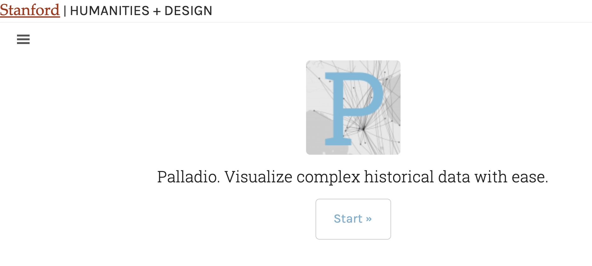
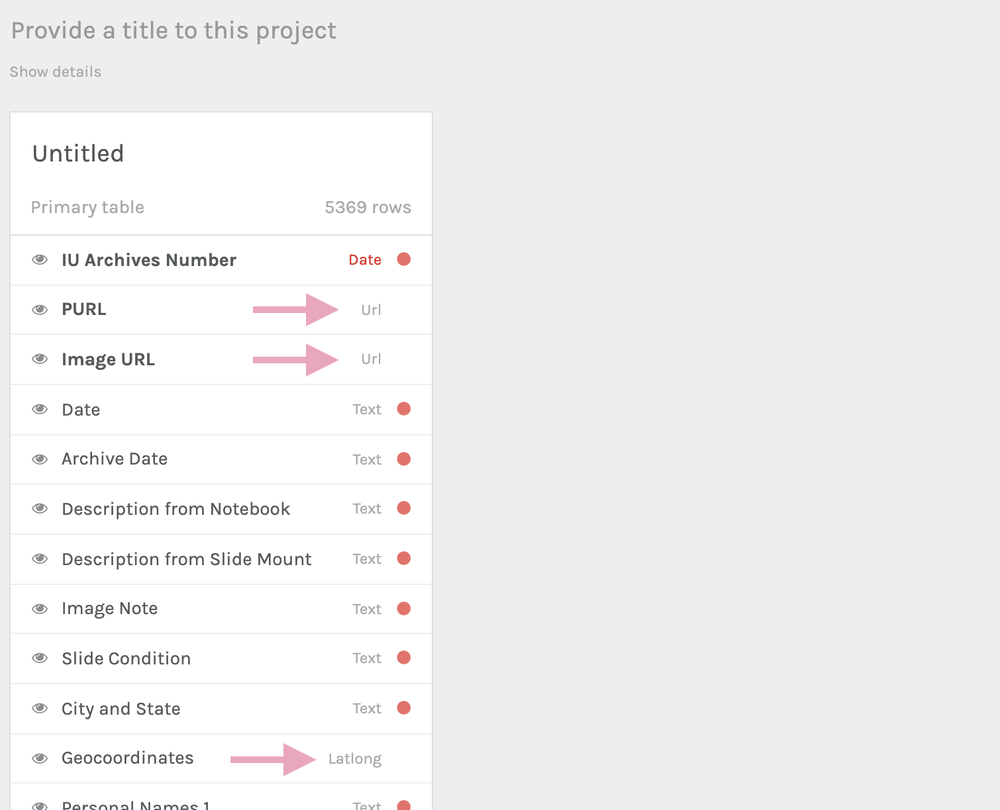
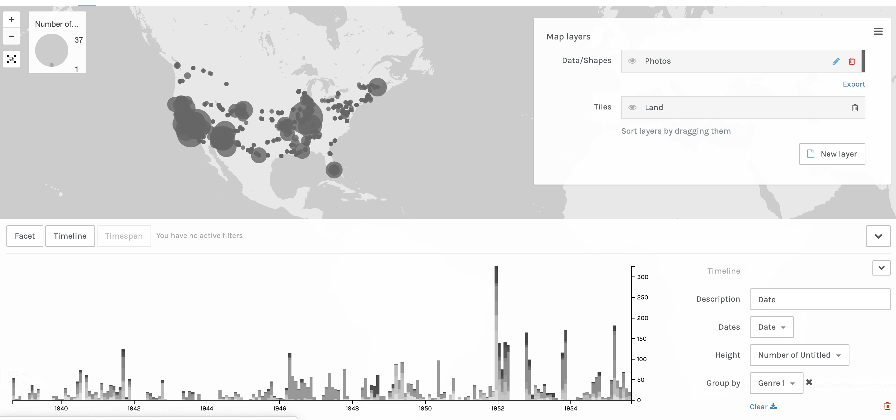

Getting started with Palladio
=============================

Palladio (palladio.designhumanities.org), a product of Stanford’s
Humanities + Design Lab, is a web-based visualization tool for complex
humanities data. Think of Palladio as a sort of Swiss Army knife for
humanities data. It’s one package that includes a number of tools, each
of which allows you to get a different angle on the same data.

Palladio is relatively new and still under active development which
means that you may encounter bugs! Still, it’s a very
useful tool for getting a handle on a complicated dataset.

**When Might Palladio be the Right Tool for You?**

**You have structured data.**

Here, “structured data” means “data in a spreadsheet”: categorized,
sorted, and stored in an Excel document or some other kind of
spreadsheet application.

**You’re interested in time, space, and relationships.**

That’s where Palladio excels: showing you how various entities are
connected across time and space.

**Your data has many attributes.**

Palladio’s really good at helping you uncover relationships among
disparate attributes over time and space for example, it can help you
see that a diarist was especially interested in trees as he traveled
through North Carolina, and especially interested in bats as he traveled
through Arizona. Palladio allows you to drill down through your data
using faceted browsing.

**When Might Palladio Not be the Right Tool for You?**

**You have unstructured data.**

If you’re trying to analyze a long text, like a poem or a novel,
Palladio won’t help you much. You’ll want to look for text analysis
tools, like [Voyant](http://voyant-tools.org/).

**You just want to count things.**

If you just want to make relatively simple charts and graphs, like a bar
or pie chart, Palladio is too much tool for you! Instead, try using
Excel’s built-in functions, or check out tools like [DataWrapper](https://www.datawrapper.de/) or [Tableau](https://public.tableau.com/en-us/s/).

**You want to present an interactive visualization.**

One big limitation of Palladio is that you can’t embed or share the
visualizations you create, except in static form. So while Palladio can
help you explore and understand your data, it’s not great for
presentation, at least not yet. Instead, try [Flourish](https://flourish.studio/),
[DataWrapper](https://public.tableau.com/en-us/s/), or [Tableau](https://public.tableau.com/en-us/s/).

**You want to create complex, fine-tuned maps and networks graphs.**

While Palladio can produce maps and network graphs, you can’t customize
them to any great extent, and you can’t perform sophisticated network
analysis, such as calculating various measures of centrality. Instead,
you might consider more sophisticated mapping tools, such as [Carto](https://carto.com/) or
[ArcGIS](https://www.arcgis.com/index.html), and more sophisticated network analysis tools, such as [Gephi](https://gephi.org/) and
[Cytoscape](https://cytoscape.org/).

**You hate bugs.**

Palladio is still fairly young, and you may encounter some
bugs. If you prefer not to use unstable software, you might investigate
[Flourish](https://flourish.studio/) or [Tableau](https://public.tableau.com/en-us/s/).

With that out of the way, we're almost ready to get started using
Palladio. First, though, a quick note that this tutorial does *not*
cover some important features of Palladio, specifically its ability to
link multiple data tables together, its timespan feature, and a feature
that allows you to use multiple basemaps. Perhaps these will be the
subject of a later tutorial!

A word on the dataset we'll use, which you can find [here](https://www.dropbox.com/s/rn40mchgrusip0x/Cushman-Collection.csv?dl=1).
This is a spreadsheet that contains the metadata for a portion of the
Charles Weever Cushman Collection of photographs, located at [Indiana
University](http://webapp1.dlib.indiana.edu/cushman/index.jsp). The full
Cushman Collection contains more than 14,500 Kodachrome photographs,
taken between 1938 and 1969. Indiana University's archivists were
forward-thinking enough to place this data on [Github](https://github.com/iulibdcs/cushman_photos), which is how we're able
to use it.

In order to make this data a little easier to work with, I've limited
this spreadsheet to photographs taken between 1938 and 1955. I've also
removed the "End Date" field to prevent confusion, changed the format of
the date field, and added geocoordinates so that we can map the data
more easily. For a great introduction to how to do some of this data
manipulation on your own data, see [this handout](https://www.dropbox.com/s/dkk4yjpc38wlpcx/Introduction%20to%20OpenRefine%20handout.pdf?dl=0), developed by Owen
Stephens on behalf of the British Library, which explains how to use the
data-cleaning application OpenRefine.

A reminder that Palladio is still under development, so it can be buggy
and slow! Some tips:

-   Work slowly. Wait for an option to finish loading before you click
    it again or click something else.

-   **Do not refresh the page.** You'll lose your work.

-   On a related note: To start over, refresh the page.

-   Clicking on the **Palladio** logo will bring you to the Palladio
    homepage, but it won't erase your work.

Navigate to Palladio.
---------------------

Go to [https://hdlab.stanford.edu/palladio/](https://hdlab.stanford.edu/palladio/) and click on **Start**.

Upload your spreadsheet.
------------------------

Locate the **Cushman-Collection.csv** file you downloaded earlier. Click on its icon and drag the file directly onto the blank box that appears under the words **Load CSV or spreadsheet**. Then press **Load**.

**Having trouble loading your data?** Check to make sure that your spreadsheet is saved as a CSV (comma-separated value) file and not an XLS (Excel) file. If you opened your spreadsheet in Excel and saved it, it may be saved as the wrong kind of file. In order to save your data as a CSV file, open the spreadsheet in Excel, then click **Save As** and choose **CSV** as the format. **CSV** is sort of the generic form for your spreadsheet, while **XLS** is Excel-specific. Palladio only likes the former!

Hey, you imported your data!
----------------------------

As you can see, each column in your spreadsheet is a different category
of data. If you look closely, you'll see that Palladio has automatically
categorized your data as different datatypes: "IU Archives Number" is a
**number**, for example, while "PURL" is a **URL**. And if you scroll
down, you'll see that "Geocoordinates" is **Latlong**.

Tell Palladio what kind of data you have.
-----------------------------------------

One of your data categories is a date, but Palladio hasn't figured that
out right away. We need to tell it, so that it treats this particular
category as temporal data.

Click on the **Date** category. In the window that pops up, select
**Date** from the **Data type** dropdown menu. Looks good! Click
**Done**.

Hide some data
--------------

We have a lot of categories here, and Palladio runs a little faster if
it has fewer of them to deal with. (Plus it's easier to see what you
have.) Let's hide some categories we won't be using by clicking on the
tiny eye to the left of the category name. I hid **Archive Date**,
**Description from Slide Mount**, **Image Note,** and **Slide
Condition**. You can always go back and reveal these if you decide you
want them after all.

Map your data!
--------------

Click on the **Map** tab at the top of the window to go to the maps view
of your data. Before we go on, let's talk about what you see in the
**Map layers** pane that appears in this window.

Palladio expects you to map your data in layers. This means that not
only could you map one kind of thing, like photos; you could layer other
kinds of things on top of that data. For example, it might be cool to
have a layer of Cushman's photos and a layer of interstate road
networks, to see if Cushman traveled on highways. Palladio lets you do
that!

But for the time being, we only have one layer: Cushman's photos. So
we'll stick with that.

Map your data! (2)
------------------

Click **New layer** to open the 'Map Layers' window. Let's tell Palladio what we want in our layer. We can name the **Layer**
whatever we want. I'll call it **Photos**.

Keep the map type as **Points**. If you happened to have data that
depicted the movement of objects from place to place, you could do a
point-to-point map. But we don't have that kind of data.

If you click on the **Places** box, you should be able to choose
**Geocoordinates** from the dropdown.

The **Tooltip Label**, which controls the label you see when your cursor
hovers over a point, can be anything you want. I'll call mine **Genre
1**, since that gives me some sense of what's in the photo.

When you've done all this, press **Add layer**.

You have a map!
---------------

Looking good! If you hover over a map point, you should get a tooltip.

Combine your map with a timeline.
---------------------------------

The ability to put data on a map is cool, but the real power of Palladio
is the ability it gives you to explore the relationships of various
features of your data through **Facets** and **Timelines**. Let's start
with a timeline, which is pretty much what it sounds like: a
visualization of the distribution of your data over time.

Start by clicking on **Timeline** tab at the bottom of your screen**.**
Group your data by **Genre 1**. Now you can see the distribution of
photos over time. That's interesting: looks like Cushman took a lot of
photos in 1952.

Filter your data by date.
-------------------------

On the bottom graph, use the crosshairs to drag (slowly!) from 1940 to
1942. A blue box appears to indicate that you're filtering your data by
date. You'll notice that the points on the map repopulate to correspond
with the timespan. You can even select multiple spans of time and see
them visualized simultaneously!

If you want to temporarily collapse your timeline so that you can see
the map better, click on the downward-pointing arrow on the right of the
timeline pane. To get rid of the date filter, click on the pink "x" next
to the datespan above the graph**.**

Note: If you're unable to "grab" your timeline in order to filter it, it
may help to lengthen your browser window.

Add a facet to further refine your data.
----------------------------------------

You've now narrowed your data down to 1940–1942. Now let's try filtering
and visualizing your data using other attributes. We can do this with a
**Facet** filter.

Click on the **Facet** tab**.** (You'll probably want to compress your
Timeline window by clicking on the downward-pointing arrow that appears
on the upper right-hand corner of the pane.)

Click on the **Dimensions** menu.

Now select **Genre 1**, **Topical Subject Heading 1**, and **Topical
Subject Heading 2**. (Actually, you can select whatever you want; I just
think these are fun ones to try.)

Explore your facets.
--------------------

Working from left to right, the facet dimensions gradually narrow down
the data displayed on the map. For example, in the image above, the map
will show where Cushman took landscape photographs that contain both
trees and shrubs. (Only on the East Coast and Great Lakes! Wonder why.)

Try playing with some other facets and altering your timeline. Find any
interesting relationships?

(You might wonder about the **Timespan** tab, which is greyed out when
we use Palladio with our dataset. If our records had start dates and end
dates, the timespan function would display those dates as "lifespans."
Take a look at this video for an explanation:
https://vimeo.com/101672780.)

Explore your data as a gallery.
-------------------------------

Maps are fun, but galleries can be useful, too, especially when you're
working with images. First, **delete your time and facet filters** by
clicking on the tiny pink garbage can that appears at the lower
right-hand corner of each pane. (You can also delete them by clicking on
the pink X's at the top of the filters pane.)

Now, click on the **Gallery** tab at the top of your window.

Change the categories your gallery displays.
--------------------------------------------

So far, not very useful. Let's change the categories your gallery is
displaying. For **Title**, choose **City and State**. For **Subtitle**,
choose **Genre 1**. For **Text**, choose **Description from Notebook**.
For **Link URL**, choose **PURL**. For **Image URL**, choose **Image
URL**. If you'd like, you can sort your gallery by **Date**.

(Actually, you can put whatever you want on these gallery cards, but
these are some categories I think are interesting.)

Filter your gallery by date and other attributes.
-------------------------------------------------

You can filter your gallery in the same way that you filter your map.
For example, in the above image, I'm looking at pictures taken in
Chicago that contain both clouds and buildings.

View your data as a network diagram.
------------------------------------

Network diagrams are good for showing the relationships among entities.
Often, those entities are people or objects, but we can use subject
headings as our entities, too.

To view your data as a network diagram, get rid of your filters and then
click on **Graph**. (Palladio is using the term "Graph" the way computer
scientists do, to mean exclusively a network graph.)

Set the parameters of your network diagram. 
--------------------------------------------

In order to create a network diagram, you need to tell Palladio which
two attributes of your data you want to explore. For **Source**, choose
**Genre 1**; for **Target**, choose **Genre 2**. Now you can see which
genres tend to co-occur in Cushman's photographs. You can click and drag
the nodes (the circles) to explore your diagram.

To highlight one kind of node in order to distinguish between the two,
click on the **Highlight** checkbox. To size nodes according to the
number of objects they represent, click on the **Size nodes** checkbox.

And you can filter your diagram in the same way you filtered your map
and gallery.

Share your work.
----------------

Unfortunately, you can't embed interactive Palladio diagrams on
webpages, but you can produce static images, either by taking a
screenshot or clicking on the **Download** link, which allows you to
download an svg file. An svg is an image, and you can post it or share
it as you like.

Download your work
------------------

Palladio doesn't save your data, but you can export your **data model**
— the way you configured your data **—** and upload it again later. This
will save you the trouble of configuring your dataset the next time you
want to work with it.

To do this, click on **Download**. This will download a file with the
extension .json. The next time you use Palladio, you can upload this
file (on the Palladio homepage) in order to open your project where you
left off.

Other cool things Palladio can do
---------------------------------

Palladio has some other cool capabilities we haven't discussed here. The
image above shows one that I like: the ability to use other
georeferenced maps (in this case an old railroad map from the New York
Public Library) as basemaps. Here's a tutorial on how to do that:
<http://hdlab.stanford.edu/doc/Tutorial%20for%20creating%20URL%20based%20tilesets_low.pdf>.

Other cool things you can do with Palladio:

-   work with multiple tables of data, connected relationally

-   export lists of data using the same filtering mechanisms we used for
    visualizations

-   create point-to-point maps

-   visualize spans of time with the timespan feature

If you're done and waiting for other people to finish
------------------------------------------------------
You might consider these questions:

- When did Cushman take the most photos?

- What did he take photos of at different times?

- What genre types tend to be co-located in photographs?

- Can you identify routes along which Cushman traveled? How might you do that?

- What do you learn by looking at the photographs this way? What don’t you learn?

And, if you'd like, you can visualize this same dataset using Google Fusion Tables. [Here's a tutorial for that.](https://github.com/miriamposner/fusion_tables/blob/master/fusiontables.md)

